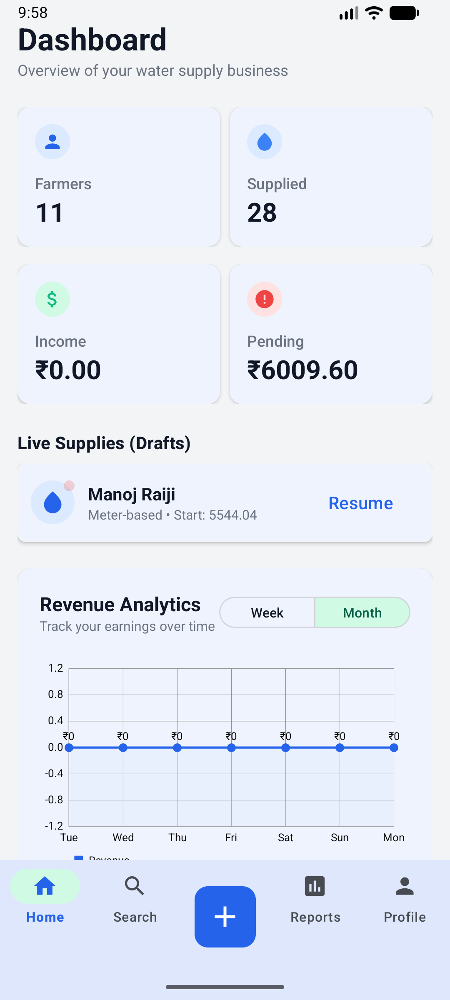
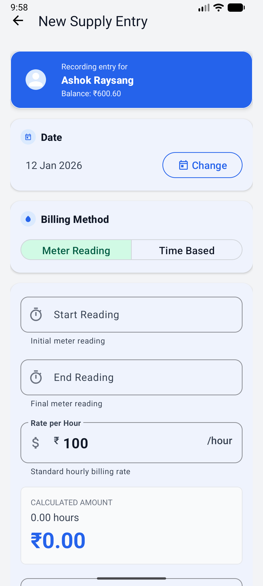
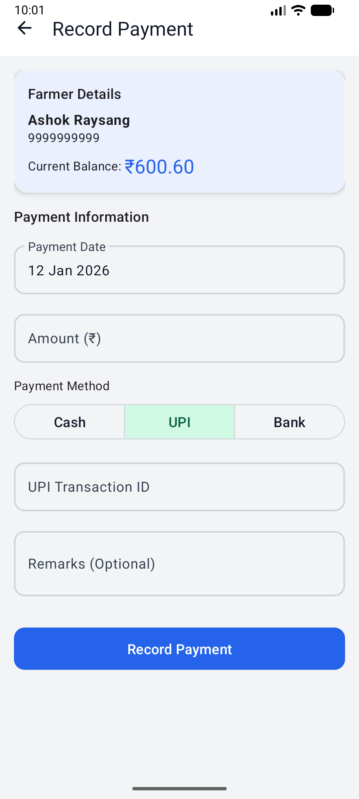
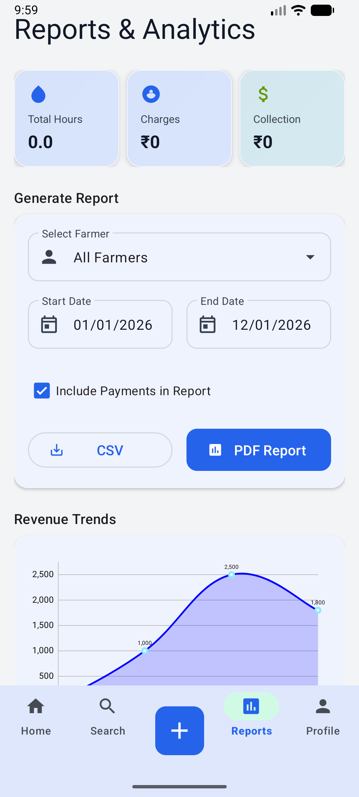
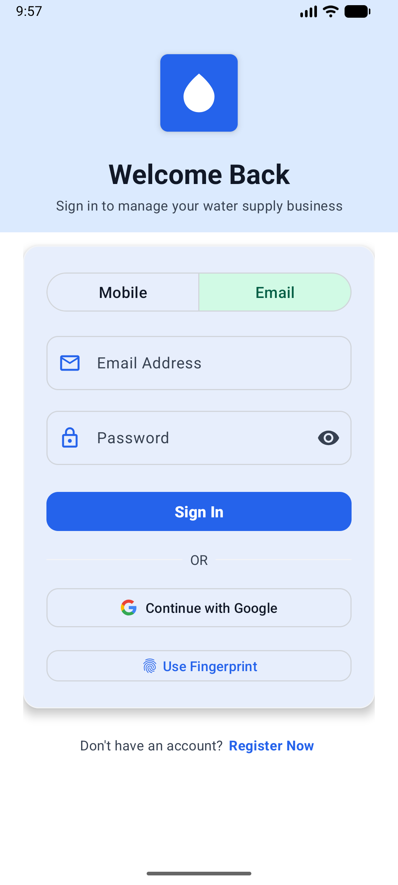
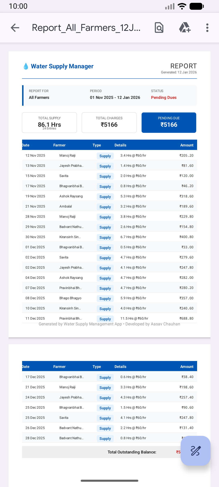
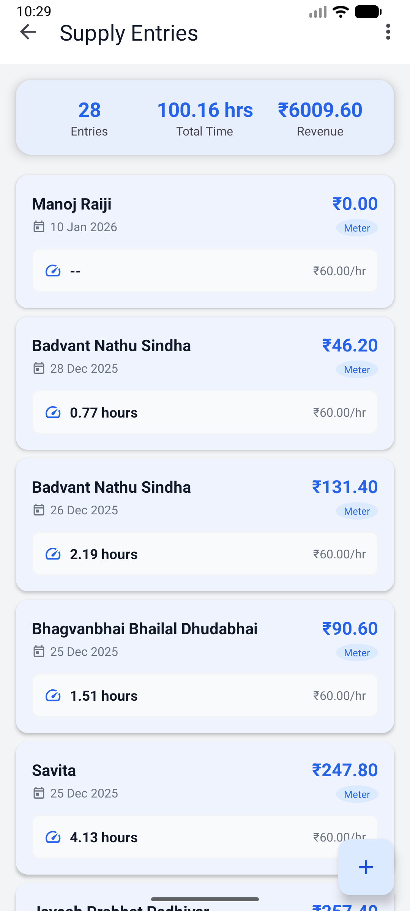
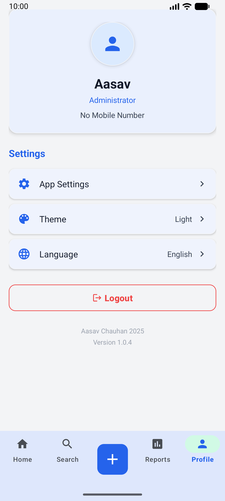

<div align="center">

  
  
  <h1 style="border-bottom: none; margin-bottom: 0;">Water Supply Management</h1>
  
  <p style="font-size: 1.2rem; color: #666; margin-top: 0;">
    Field-ready offline utility for modern water teams.
  </p>

  <p>
    <a href="https://github.com/aasavchauhan/Water-Supply-Management-System/releases/latest">
      
    </a>
    <a href="https://github.com/aasavchauhan/Water-Supply-Management-System/actions">
       
    </a>
  </p>

  <p>
    
    
    
    
    
  </p>

</div>

<br>

<div align="center">

  **OFFLINE-FIRST** • **BIOMETRIC SECURITY** • **REAL-TIME SYNC** • **ANALYTICS**
  
</div>

<br>

## 📱 App Showcase

| Dashboard & Stats | Farmer Profiles | Smart Billing |
|:---:|:---:|:---:|
|  |  |  |
| **Payment Collection** | **Reports & Analytics** | **Login / Sign Up** |
|  |  |  |
| **PDF Exports** | **Supplies List** | **Settings** |
|  |  |  |

> **Note**: These screenshots demonstrate the live field experience.

---

## 🚀 Key Features

### 🔐 Security & Access
*   **Biometric Login**: Secure app entry using Fingerprint/Face ID.
*   **Role-Based Access**: Granular control for admins and field agents.
*   **Privacy Focused**: No data shared with third parties.

### 💧 Supply Management
*   **Dual Billing Modes**: Support for both **Volume-based (Meter)** and **Time-based** billing.
*   **Live Calculation**: Automatic amount calculation based on farmer-specific rates.
*   **Offline Support**: Record supplies even without internet; auto-sync when online.

### 📊 Analytics & Reports
*   **Visual Revenue**: Interactive charts powered by MPAndroidChart.
*   **Payment Tracking**: Track dues, partial payments, and history.
*   **Exportable Data**: Ready for generating billing statements.

---

## 📥 Installation

### Option 1: Direct Install (APK)
Perfect for field agents and non-developers.
1.  Go to [**Releases**](https://github.com/aasavchauhan/Water-Supply-Management-System/releases/latest).
2.  Download `app-release.apk`.
3.  Install on any Android device (Android 8.0+).

### Option 2: Build from Source
For developers contributing to the codebase.

```bash
# 1. Clone the repository
git clone https://github.com/aasavchauhan/Water-Supply-Management-System.git

# 2. Add Firebase Config
# Place your 'google-services.json' in /app

# 3. Build with Gradle
./gradlew assembleDebug
```

---

## 🛠 Tech Stack

*   **Language**: Java 11
*   **Architecture**: MVVM (Model-View-ViewModel) / Clean Architecture
*   **Dependency Injection**: Hilt
*   **Database**: Cloud Firestore (Offline Persistence Enabled)
*   **Auth**: Firebase Auth (Phone OTP, Google, Email)
*   **UI**: Material Design 3, ViewBinding, MPAndroidChart

---

## 🤝 Contributing

We welcome contributions! Please see [CONTRIBUTING.md](CONTRIBUTING.md) for details on how to submit Pull Requests.

1.  Fork the Project
2.  Create your Feature Branch (`git checkout -b feature/AmazingFeature`)
3.  Commit your Changes (`git commit -m 'Add some AmazingFeature'`)
4.  Push to the Branch (`git push origin feature/AmazingFeature`)
5.  Open a Pull Request

---

## 📄 License

Distributed under the MIT License. See [LICENSE](LICENSE) for more information.

<div align="center">
  <sub>Built with ❤️ by Aasav Chauhan</sub>
</div>
